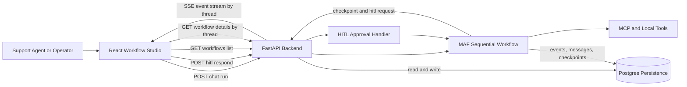
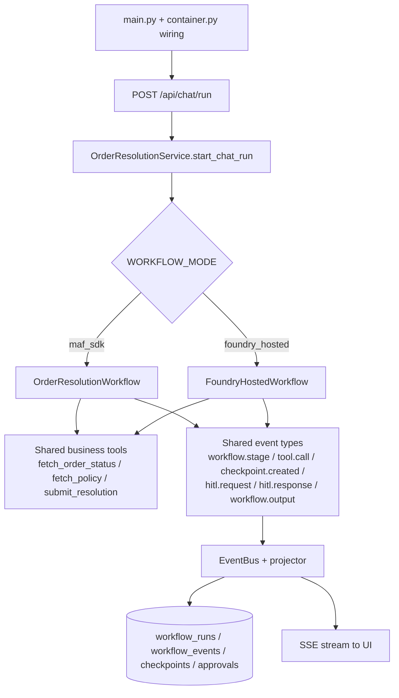

# Architecture: Order Resolution Workflow

## Purpose

This document describes the business architecture for the order-resolution use case, including runtime components, key data flows, and verifiability checkpoints.

## Business Problem

Support teams need to resolve delivery and product issues quickly while keeping risky actions (refunds, sensitive resolutions) under explicit human control. The system must:

- automate common low-risk cases,
- escalate or gate high-risk actions with HITL,
- preserve conversation and workflow history for auditability,
- provide a transparent UI timeline for operators.

## Project Goal

Deliver a verifiable multi-agent workflow for customer order issue resolution that is:

- operationally transparent (SSE timeline, workflow history),
- business-safe (deterministic HITL triggers and approvals),
- durable (Postgres-backed persistence for runs/events/messages/checkpoints),
- extensible (local MAF now, Azure app-hosted deployed, Foundry-hosted invocations integration in progress).

## High-Level Runtime Architecture



ASCII fallback (if Mermaid rendering is unavailable):

```text
+---------------------------+
| Support Agent / Operator  |
+-------------+-------------+
              |
              v
+---------------------------+       GET workflows / details
| React Workflow Studio UI  |------------------------------+
+-------------+-------------+                              |
              | POST chat run                             |
              v                                           |
+---------------------------+       read/write            |
| FastAPI Backend           |<-------------------->+----------------------+
+------+--------------------+                     | Postgres Persistence |
       |                                          | runs/events/messages |
       | start workflow                           | checkpoints/approvals|
       v                                          +----------------------+
+---------------------------+
| MAF Sequential Workflow   |
| Triage -> Policy ->       |
| Resolution                |
+------+---------------+----+
       |               |
       | tool calls    | checkpoint + hitl.request
       v               v
+----------------+   +---------------------------+
| MCP/Local      |   | Human Approval Panel      |
| Tools          |   | Approve / Reject          |
+----------------+   +-------------+-------------+
                                 |
                                 | POST hitl respond
                                 v
                      +---------------------------+
                      | HITL Approval Handler     |
                      +-------------+-------------+
                                    |
                                    v
                      +---------------------------+
                      | Resume Workflow Execution |
                      +---------------------------+

Live updates: FastAPI Backend -> SSE event stream by thread -> UI timeline
```

## Workflow-Mode Mapping (Shared Tools + Events, Different Workflow Engines)

Both execution modes keep the **same API surface**, **same business tools**, and **same stable event contract**.
What changes is the workflow engine behind the service boundary.



ASCII fallback:

```text
main.py/container
      |
      v
POST /api/chat/run
      |
      v
OrderResolutionService
      |
      +--> WORKFLOW_MODE=maf_sdk ---------> OrderResolutionWorkflow --------+
      |                                                                      |
      +--> WORKFLOW_MODE=foundry_hosted -> FoundryHostedWorkflow -----------+
                                                                             |
                                                                             v
                               Shared tools: fetch_order_status/fetch_policy/submit_resolution
                                                                             |
                                                                             v
     Shared stable events: workflow.stage, tool.call, checkpoint.created, hitl.request,
                           hitl.response, workflow.output
                                                                             |
                                                                             v
                           EventBus -> DB projections + SSE timeline to UI
```

### What is shared vs what differs

- **Shared:** router/service entrypoints, business tool semantics, HITL semantics, stable SSE event names, persistence projections.
- **Different:** workflow engine implementation (`OrderResolutionWorkflow` vs `FoundryHostedWorkflow`) and where orchestration runs.

## Core Business Flow

1. User submits an order issue from the UI.
2. Backend starts a sequential workflow: triage, policy retrieval/analysis, resolution decision.
3. If the decision is low risk, workflow completes automatically and emits output.
4. If risk threshold is met, workflow emits `checkpoint.created` + `hitl.request` and pauses.
5. Reviewer approves/rejects in UI.
6. Workflow resumes from checkpoint:

- approve -> completes with final output,
- reject -> emits escalated output/state.

7. UI timeline and history endpoints display full execution trace.

Detailed behavior and trigger conditions are aligned with `docs/design/userflow.md` and `docs/design/hitl-approval-conditions.md`.

## Persistence and Auditability

Durable state is stored in Postgres so runs survive backend restarts:

- `workflow_runs`: query-friendly summary per thread,
- `workflow_events`: append-only execution timeline,
- `conversation_messages`: persisted transcript/context,
- `checkpoints`: HITL pause/resume state,
- `approvals`: reviewer decisions and audit trail.

This enables deterministic replay of what happened, why it happened, and who approved/rejected critical actions.

## Verifiability Model

The architecture is verifiable at three levels:

1. Functional tests:

- backend tests cover low-risk and high-risk/HITL flows.

2. Evaluation harness:

- eval cases validate expected HITL/no-HITL outcomes across baseline scenarios.

3. End-to-end UX checks:

- Playwright tests verify timeline visibility, HITL approval/rejection paths, and terminal states.

Required commands:

- `make test`
- `make eval-backend`
- `make test-e2e`

## Future Hosting Evolution

The same business flow is intended to transition through:

1. local MAF runtime (implemented),
2. Azure app-hosted runtime (deployed),
3. Foundry-hosted runtime (invocations integration in progress).

Architecture keeps API and event contracts stable to simplify this progression while maintaining business traceability.
