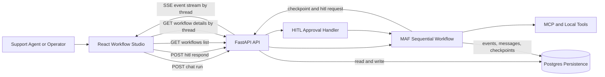
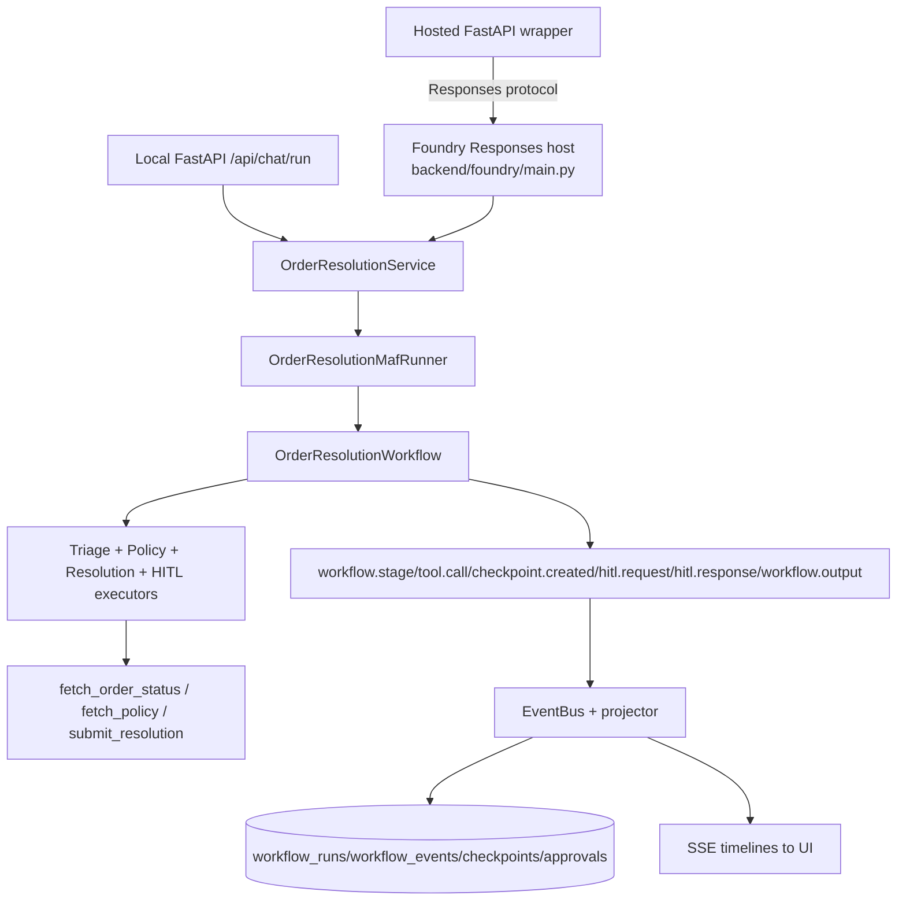

# Architecture: Order Resolution Workflow

## Purpose

This document describes the business architecture for the order-resolution use case, including runtime components, key data flows, and verifiability checkpoints.

## Business Problem

Support teams need to resolve delivery and product issues quickly while keeping risky actions (refunds, sensitive resolutions) under explicit human control. The system must:

- automate common low-risk cases,
- escalate or gate high-risk actions with HITL,
- preserve conversation and workflow history for auditability,
- provide a transparent UI timeline for operators.

## Project Goal

Deliver a verifiable multi-agent workflow for customer order issue resolution that is:

- operationally transparent (SSE timeline, workflow history),
- business-safe (deterministic HITL triggers and approvals),
- durable (Postgres-backed persistence for runs/events/messages/checkpoints),
- extensible (single MAF workflow path, local API/SSE UI, and Foundry-hosted Responses-native entrypoint).

## High-Level Runtime Architecture



ASCII fallback (if Mermaid rendering is unavailable):

```text
+---------------------------+
| Support Agent / Operator  |
+-------------+-------------+
              |
              v
+---------------------------+       GET workflows / details
| React Workflow Studio UI  |------------------------------+
+-------------+-------------+                              |
              | POST chat run                             |
              v                                           |
+---------------------------+       read/write            |
| FastAPI Backend           |<-------------------->+----------------------+
+------+--------------------+                     | Postgres Persistence |
       |                                          | runs/events/messages |
       | start workflow                           | checkpoints/approvals|
       v                                          +----------------------+
+---------------------------+
| MAF Sequential Workflow   |
| Triage -> Policy ->       |
| Resolution                |
+------+---------------+----+
       |               |
       | tool calls    | checkpoint + hitl.request
       v               v
+----------------+   +---------------------------+
| MCP/Local      |   | Human Approval Panel      |
| Tools          |   | Approve / Reject          |
+----------------+   +-------------+-------------+
                                 |
                                 | POST hitl respond
                                 v
                      +---------------------------+
                      | HITL Approval Handler     |
                      +-------------+-------------+
                                    |
                                    v
                      +---------------------------+
                      | Resume Workflow Execution |
                      +---------------------------+

Live updates: FastAPI Backend -> SSE event stream by thread -> UI timeline
```

## Public hosted topology

The public browser path keeps the same HTTP and SSE contracts while moving
workflow execution to the hosted Foundry Responses agent:

```text
Browser
  -> external React/Nginx Container App
  -> same-origin /api proxy
  -> internal FastAPI responses-wrapper Container App
  -> managed-identity Foundry Responses invocation
  -> shared PostgreSQL workflow/checkpoint/approval/event state
```

The backend creates a Foundry `conv_...` conversation before initial dispatch
and persists that identifier as the UI-visible thread. The agent and wrapper are
separate processes, so wrapper-mode SSE reads persisted workflow events rather
than an in-memory event bus. The browser never receives a Foundry credential or
calls Foundry directly.

## Runtime mapping (local API and hosted wrapper)

There is one business workflow implementation (`OrderResolutionWorkflow`) and one
service entrypoint (`OrderResolutionService`). Local FastAPI and the
Foundry-hosted path invoke the same service/workflow behavior.



### Shared vs distinct

- **Shared:** business tools, HITL semantics, stable event contracts, persistence projections.
- **Distinct wrappers:** local FastAPI route layer, the hosted FastAPI
  Responses-wrapper, and the Foundry Responses host in `backend/foundry/main.py`.

## Core Business Flow

1. User submits an order issue from the UI.
2. Backend starts a sequential workflow: triage, policy retrieval/analysis, resolution decision.
3. If the decision is low risk, workflow completes automatically and emits output.
4. If risk threshold is met, workflow emits `checkpoint.created` + `hitl.request` and pauses.
5. Reviewer approves/rejects in UI.
6. Workflow resumes from checkpoint:

- approve -> completes with final output,
- reject -> emits escalated output/state.

7. UI timeline and history endpoints display full execution trace.

Detailed behavior and trigger conditions are aligned with `docs/design/userflow.md` and `docs/design/hitl-approval-conditions.md`.

## Persistence and Auditability

Durable state is stored in Postgres so runs survive backend restarts:

- `workflow_runs`: query-friendly summary per thread,
- `workflow_events`: append-only execution timeline,
- `conversation_messages`: persisted transcript/context,
- `checkpoints`: HITL pause/resume state,
- `approvals`: reviewer decisions and audit trail.

This enables deterministic replay of what happened, why it happened, and who approved/rejected critical actions.

## Verifiability Model

The architecture is verifiable at three levels:

1. Functional tests:

- backend tests cover low-risk and high-risk/HITL flows.

2. Evaluation harness:

- eval cases validate expected HITL/no-HITL outcomes across baseline scenarios.

3. End-to-end UX checks:

- Playwright tests verify timeline visibility, HITL approval/rejection paths, and terminal states.

Required commands:

- `make test`
- `make eval-backend`
- `make test-e2e`

## Execution surfaces

The same business flow runs across:

1. local FastAPI/SSE/UI runtime,
2. public Foundry-hosted Responses-native runtime,
3. public browser runtime through frontend ACA -> internal FastAPI wrapper ACA ->
   Foundry Responses.

Foundry Responses is not a public replacement for the API routes. The hosted
wrapper preserves the browser's API/SSE contract and uses PostgreSQL for durable
event projection.

Process/governance authority for delivery and verification is documented in `docs/design/engineering-operating-model.md`.
