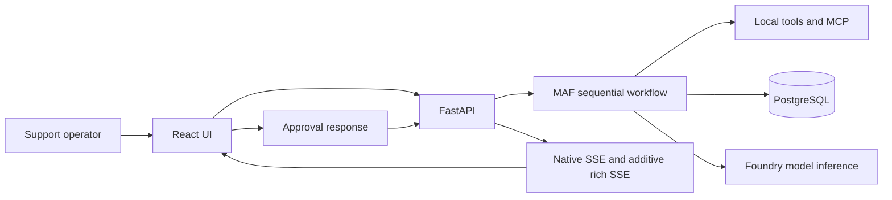

# Architecture: Order Resolution Workflow

## Purpose

The application resolves customer order issues while preserving deterministic
human approval for risky actions, durable audit history, and an observable UI
timeline.

## Runtime

FastAPI is the sole application host for the MAF workflow. The React UI calls
the API; the workflow uses tools and MCP as configured, persists state in
PostgreSQL, and emits native SSE events. Foundry is limited to model inference
and report-only evaluation of FastAPI workflow captures.

```mermaid
flowchart LR
    U[Support operator] --> UI[React UI]
    UI --> API[FastAPI]
    API --> MAF[MAF sequential workflow]
    MAF --> TOOLS[Local tools and MCP]
    MAF --> PG[(PostgreSQL)]
    MAF --> MODEL[Foundry model inference]
    API --> SSE[Native SSE and additive rich SSE]
    SSE --> UI
    UI --> HITL[Approval response]
    HITL --> API
```

## Business flow

1. The operator submits an order issue.
2. The workflow performs triage, policy retrieval, and resolution.
3. Low-risk resolutions emit `workflow.output`.
4. Risky resolutions emit `checkpoint.created` and `hitl.request`, then pause.
5. An approval or rejection resumes the checkpoint and produces terminal output.
6. PostgreSQL preserves runs, events, messages, checkpoints, and approvals.

## Stable contracts

- Native SSE types: `workflow.stage`, `tool.call`, `checkpoint.created`,
  `hitl.request`, `hitl.response`, and `workflow.output`.
- The rich SSE endpoint is additive and must preserve native event payloads.
- HITL triggers are deterministic; see
  [HITL approval conditions](hitl-approval-conditions.md).

## Azure target

The planned Container Apps package is `infra/azure-apphosted/`. Its target is
`rg-maf-ora-azure` in North Central US. East US is excluded because Azure
PostgreSQL has an offer restriction. No deployment is claimed.
