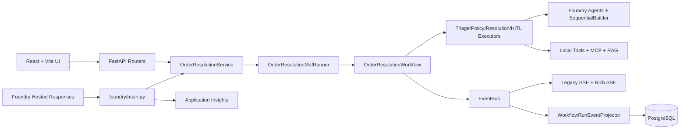

# Order Resolution Agent Codebase Review

## 1. Executive summary

The repository already has strong workflow contract coverage (low-risk complete, high-risk HITL, reject/escalate) and a working Foundry-hosted Responses entrypoint, but maintainability debt is concentrated in composition and boundary seams. The MAF path is now modularized into prompts, agents, tools, and stage executors while preserving the existing `SequentialBuilder` orchestration (`backend/app/maf/workflows/order_resolution.py`, `backend/app/maf/executors/*`).

Key risk areas remain API/auth hardening, import-time container initialization, and module boundary leakage from service/persistence into API schema types (`backend/app/modules/order_resolution/service.py:5-6`, `backend/app/infrastructure/persistence/workflow_run_repository.py:7-15`, `backend/app/core/container.py:15-46`).

## 2. Architecture diagram

Evidence: `backend/app/api/v1/routers/chat.py`, `backend/app/modules/order_resolution/service.py`, `backend/app/maf/runner.py`, `backend/app/maf/workflows/order_resolution.py`, `backend/foundry/main.py`, `backend/app/core/container.py`.

## 3. Component inventory

| Component | Responsibility | Evidence |
| --- | --- | --- |
| API routers | Chat run/stream and HITL response endpoints | `backend/app/api/v1/routers/chat.py`, `backend/app/api/v1/routers/hitl.py` |
| Application service | Creates workflow context and invokes workflow engine | `backend/app/modules/order_resolution/service.py:21-54` |
| Workflow runtime | Emits events, runs triage/policy/resolution/HITL flow | `backend/app/maf/workflows/order_resolution.py:35-453` |
| Executors | Stage logic split for triage, policy inputs, decisioning, HITL | `backend/app/maf/executors/triage.py`, `policy.py`, `resolution.py`, `hitl.py` |
| Agent/prompt packages | Foundry agent creation and instruction definitions | `backend/app/maf/agents/order_resolution.py`, `backend/app/maf/prompts/order_resolution.py` |
| Persistence | Workflow runs, events, approvals, session messages | `backend/app/infrastructure/persistence/workflow_run_repository.py` |
| Foundry hosted adapter | Responses protocol parsing and hosted invocation bridge | `backend/foundry/main.py` |
| Frontend workflow UX | Workflow timeline, approvals, manual cases | `frontend/src/App.tsx`, `scripts/playwright/tests/workflow.e2e.spec.ts` |

## 4. Data flow

1. `POST /api/chat/run` creates run metadata and starts workflow (`backend/app/api/v1/routers/chat.py:11-13`, `backend/app/modules/order_resolution/service.py:21-41`).
2. Workflow emits stable event types (`workflow.stage`, `tool.call`, `checkpoint.created`, `hitl.request`, `hitl.response`, `workflow.output`) to EventBus (`backend/app/maf/workflows/order_resolution.py:95-311`).
3. Event projector writes run/event/pending-approval projections to Postgres (`backend/app/core/container.py:30-31`, `backend/app/infrastructure/persistence/workflow_run_repository.py`).
4. UI consumes SSE streams from `/api/chat/stream/{thread_id}` and `/rich` additive stream (`backend/app/api/v1/routers/chat.py:16-31`).
5. Foundry hosted path receives Responses requests, translates to service calls, and returns output payloads (`backend/foundry/main.py`).

## 5. Authentication flow

- Foundry model calls use `DefaultAzureCredential` in runtime (`backend/app/maf/clients.py:62-71`).
- Hosted Foundry entrypoint depends on environment-provided model/database variables from `agent.yaml` (`backend/agent.yaml:10-33`).
- API layer currently has no auth dependency for chat/HITL routes (`backend/app/api/v1/routers/chat.py`, `backend/app/api/v1/routers/hitl.py`), and CORS is open to all origins (`backend/app/main.py:19-24`).

## 6. External dependencies

- Backend runtime stack: FastAPI, Psycopg, Agent Framework, Foundry clients, Azure Identity, Azure Monitor OpenTelemetry (`backend/requirements.txt`).
- Test/dev stack: pytest, pytest-asyncio, ruff, black (`backend/requirements-dev.txt`).
- Frontend E2E: Playwright suite with hosted/local paths (`scripts/playwright/tests/workflow.e2e.spec.ts`).
- Build/validation automation: Make targets for lint/test/eval/e2e and Foundry deploy/smoke (`Makefile:68-199`).

## 7. Technical debt

1. Import-time composition + schema init can make startup side effects hard to isolate (`backend/app/core/container.py:15-46`).
2. Service layer depends on API schema objects (`backend/app/modules/order_resolution/service.py:5-6`).
3. Persistence repository returns API response schema objects directly (`backend/app/infrastructure/persistence/workflow_run_repository.py:7-15`).
4. Foundry hosted adapter is large and combines parsing, protocol bridging, and workflow invocation (`backend/foundry/main.py`).
5. Frontend orchestration remains concentrated in one large `App.tsx` component (`frontend/src/App.tsx`).

## 8. Security concerns

1. Open CORS policy (`allow_origins=["*"]`) in app runtime (`backend/app/main.py:19-24`).
2. Unauthenticated workflow/HITL endpoints (`backend/app/api/v1/routers/chat.py`, `backend/app/api/v1/routers/hitl.py`).
3. HITL reviewer identity is request-supplied and not tied to authenticated principal (`backend/app/api/v1/schemas/hitl.py`, `frontend/src/App.tsx`).
4. Foundry parse debug mode can log message previews if enabled (`backend/foundry/main.py:67-103`).

## 9. Testing gaps

1. No dedicated unit tests yet for new prompt/agent/executor modules.
2. No auth tests at API layer because auth is not enforced.
3. No explicit automated boundary test preventing API schema imports in service/persistence layers.
4. Frontend lacks component/unit tests; behavior is mostly covered via Playwright.

Coverage that is already strong: deterministic + HITL + resume/reject workflow behavior (`backend/tests/test_workflow.py`) and hosted path contract tests (`backend/tests/test_foundry_hosted.py`).

## 10. Top 10 refactoring opportunities

1. **Done in this phase:** split MAF internals into prompts/agents/tools/executors/runner packages.
2. Add unit tests for prompt renderers, agent factory wiring, and executor invariants.
3. Introduce API authN/authZ and enforce reviewer identity from principal claims.
4. Move service input/output types to module-domain schemas (not API schemas).
5. Move repository DTOs to infrastructure/domain models and map at API boundary.
6. Convert import-time container wiring to explicit app lifespan/factory initialization.
7. Break `backend/foundry/main.py` into parser, adapter, and protocol response modules.
8. Split frontend `App.tsx` into API client, workflow state store, and panel components.
9. Add boundary/layer lint rules for `api -> modules -> core/infrastructure -> maf` ownership.
10. Consolidate Foundry deploy/smoke diagnostics scripts into one reusable command path.
