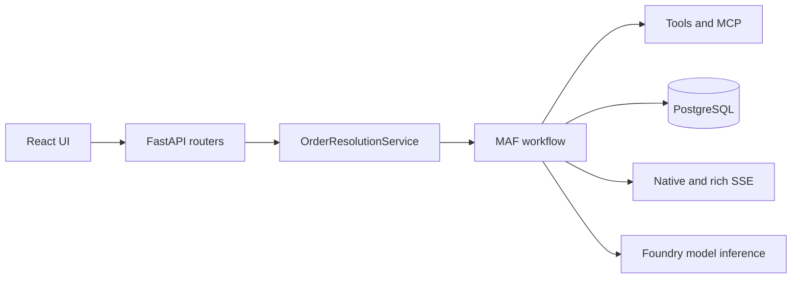

# Order Resolution Agent Codebase Review

## Current architecture

The React frontend calls the FastAPI application, which invokes
`OrderResolutionService` and the MAF workflow. PostgreSQL persists runs,
events, sessions, checkpoints, and approvals. SSE projects the native event
stream to the UI; the rich stream is additive.

```mermaid
flowchart LR
    UI[React UI] --> API[FastAPI routers]
    API --> SVC[OrderResolutionService]
    SVC --> MAF[MAF workflow]
    MAF --> TOOLS[Tools and MCP]
    MAF --> PG[(PostgreSQL)]
    MAF --> SSE[Native and rich SSE]
    MAF --> MODEL[Foundry model inference]
```

FastAPI is the sole application host. Foundry integration is a model client and
report-only evaluation capability, not a workflow host.

## Boundaries

| Area | Responsibility |
| --- | --- |
| `backend/app/api/v1/*` | HTTP and SSE contracts |
| `backend/app/modules/order_resolution/*` | Application service, domain seams, projections |
| `backend/app/maf/*` | Prompts, agents, executors, tools, runner, workflow |
| `backend/app/infrastructure/*` | Persistence and external adapters |
| `backend/app/core/*` | Configuration, database, telemetry, composition |

## Current risks to address separately

- API authentication and authorization are not part of the current POC contract.
- Keep service and persistence types independent of API schemas.
- Preserve deterministic HITL coverage for low-risk, high-risk, resume, reject,
  and duplicate-response scenarios.
