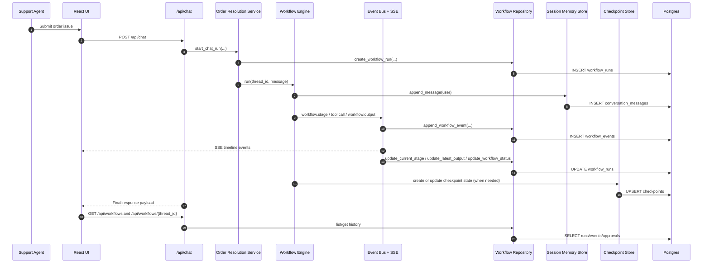

# User Flow

## Delivery Journey and Status

The product journey is:

1. Local FastAPI + MAF runtime
2. Azure Container Apps FastAPI + MAF runtime

Current status:

| Stage            | Status      | What is actually wired today                                                                                     |
| ---------------- | ----------- | ---------------------------------------------------------------------------------------------------------------- |
| Local MAF        | Implemented | FastAPI composes the shared workflow directly from `backend/app/maf/workflows/order_resolution.py`. |
| Azure app-hosted | Implemented | Same shared workflow behavior on ACA + Postgres. |

## Current Runtime User Flow (Implemented Path)

1. User enters an order issue in UI and submits.
2. UI starts SSE stream for the active thread.
3. Backend executes sequential stages:
   - Triage agent extracts order and issue type.
   - Policy retrieval stage performs the configured MCP/local lookup and records evidence IDs.
   - Policy agent calls tools and MCP lookup.
   - Resolution agent decides action and HITL requirement.
4. If HITL required:
   - Backend emits `checkpoint.created` and `hitl.request`.
   - UI shows approval panel.
5. Reviewer approves/rejects via UI.
6. Backend resumes from checkpoint and emits `workflow.output`.
7. UI appends final output and keeps thread available for follow-up turns.

If the same approval/rejection request is accidentally submitted more than once for a checkpoint, backend handling is idempotent and does not emit duplicate terminal events.

## End-to-End Happy Path (UI -> API -> Backend -> Postgres)

Mermaid:



ASCII fallback:

```text
Support Agent
   |
   v
React UI (frontend/src/App.tsx, components/*)
   | POST /api/chat
   v
FastAPI Chat API (backend/app/api/v1/routers/chat.py)
   |
   v
Order Resolution Service (backend/app/modules/order_resolution/service.py)
   |
   v
Workflow Runtime (backend/app/maf/workflows/order_resolution.py)
   |-- write transcript --> Session Memory Store (backend/app/infrastructure/persistence/session_memory.py)
   |                         -> Postgres table: conversation_messages
   |
   |-- emit events -------> Event Bus (backend/app/infrastructure/events/event_bus.py)
      |                         -> projector (backend/app/modules/order_resolution/projections.py)
   |                         -> repository (backend/app/infrastructure/persistence/workflow_run_repository.py)
   |                         -> Postgres tables: workflow_runs, workflow_events, approvals
   |
   |-- checkpoint state --> Checkpoint Store (backend/app/infrastructure/persistence/checkpoint_store.py)
   |                         -> Postgres table: checkpoints
   |
   +-- final output ------> API response + SSE stream to UI timeline

History views:
UI -> GET /api/workflows, /api/workflows/{thread_id}, /api/sessions/{session_id}/messages
   -> backend/app/api/v1/routers/workflows.py + backend/app/api/v1/routers/sessions.py
   -> backend/app/infrastructure/persistence/workflow_run_repository.py
   -> Postgres read models
```

Primary file touchpoints in this path:

- UI: `frontend/src/App.tsx`, `frontend/src/components/*`
- API: `backend/app/api/v1/routers/chat.py`, `backend/app/api/v1/routers/workflows.py`, `backend/app/api/v1/routers/sessions.py`
- API schemas: `backend/app/api/v1/schemas/*`
- Service facade: `backend/app/modules/order_resolution/service.py`
- Runtime wiring: `backend/app/core/container.py`
- Event projection: `backend/app/modules/order_resolution/projections.py`
- Workflow logic: `backend/app/maf/workflows/order_resolution.py`
- Persistence adapters: `backend/app/infrastructure/persistence/*`
- Schema: `backend/app/sql/schema.sql`

### Event Contract (must stay stable for frontend/tests)

- `workflow.stage`
- `tool.call`
- `checkpoint.created`
- `hitl.request`
- `hitl.response`
- `workflow.output`

## Policy Evidence IDs

- The existing `tool.call` event includes `policy_evidence_ids` and `policy_retrieval` metadata (`provider`, `query_id`, `count`).
- Event type contracts are unchanged.
- The stable SSE stream remains the primary contract. A parallel rich stream at `/api/chat/stream/{thread_id}/rich` projects native workflow events into AG-UI-compatible lifecycle, step, tool, text/output, HITL/custom, and raw events, and the current UI consumes it for live timeline updates.

## API Pagination Contracts

- Workflow history: `GET /api/workflows?page=<n>&page_size=<n>` (legacy `pageSize` remains supported).
- Workflow timeline events: `GET /api/workflows/{thread_id}/events?limit=<n>&cursor=<token>`.
- Session transcript messages: `GET /api/sessions/{session_id}/messages?limit=<n>&cursor=<id>`.

## HITL Test Reference

For exact conditions that trigger human approval and ready-to-run test scenarios, see:

- `hitl-approval-conditions.md`
- `engineering-operating-model.md`
